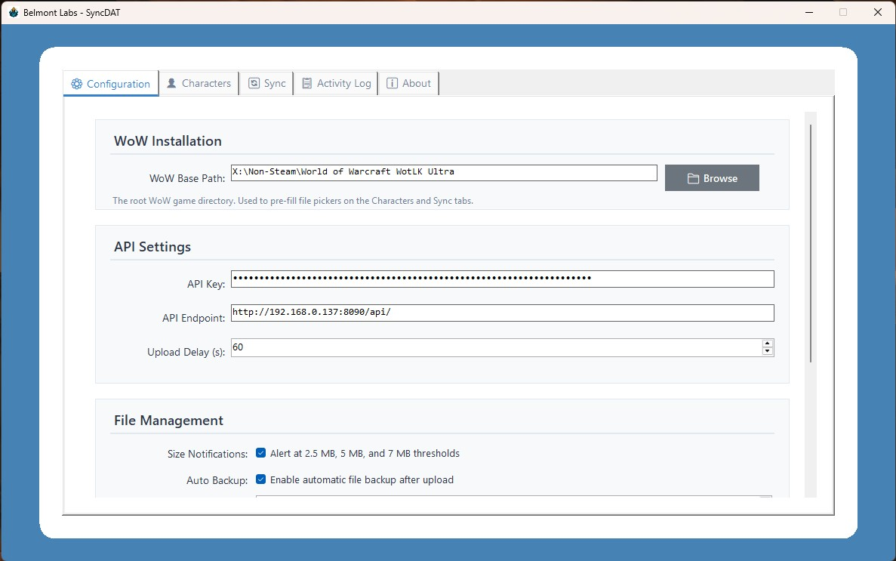
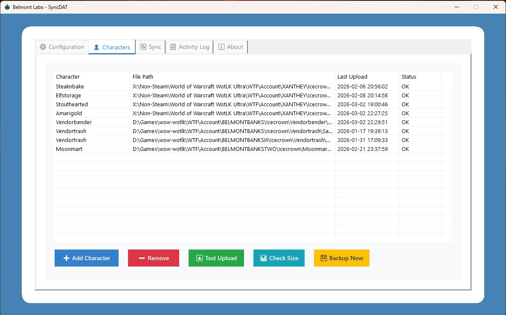
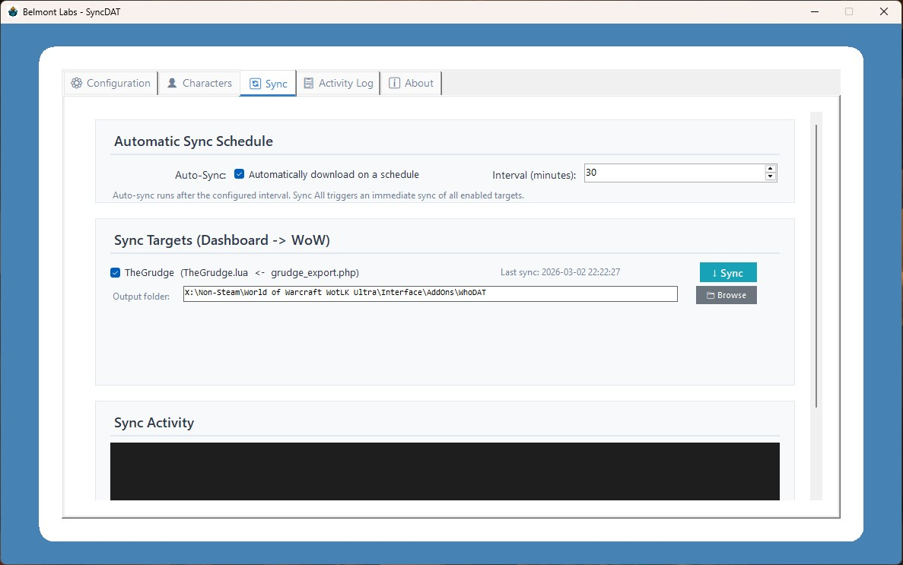
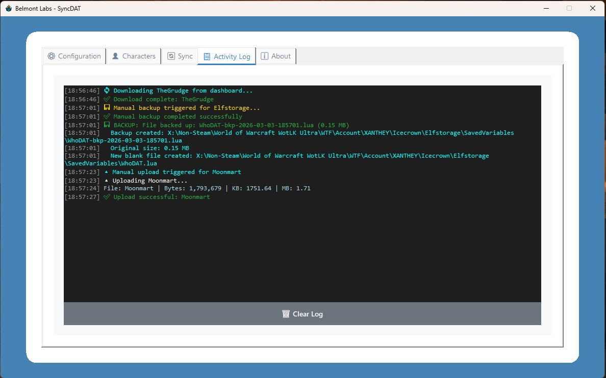

# Belmont Labs — SyncDAT

> *"Excellent. The data flows in both directions now. Just as I designed. Mostly."*
> — Belmont Labs Research Division

**SyncDAT** is the Windows desktop sync bridge between your World of Warcraft client and the [WhoDASH](https://www.belmontlabs.dev) web dashboard. It handles both directions of data flow — uploading your SavedVariables to the dashboard, and downloading dashboard-generated addon files back to your WoW client.
<table border="0" cellpadding="0" cellspacing="0">
  <tr>
    <td align="center" valign="top"></td>
    <td align="center" valign="top"></td>
    <td align="center" valign="top"></td>
    <td align="center" valign="top"></td>
  </tr>
</table>
---

## ⬇️ Download

**[SyncDAT.zip](https://www.belmontlabs.dev/SyncDAT.zip)** — 64,614 KB  
Self-contained executable. No .NET installation required. No dependencies. Unzip and run.

> Requires Windows 10 or 11 (x64).

---

## What It Does

### 🔼 Upload Direction (WoW → Dashboard)
- Watches your WoW `SavedVariables` folder for changes to `WhoDAT.lua`
- Automatically uploads character data to your WhoDASH server after a configurable delay
- Supports multiple characters / multiple watched files simultaneously
- File size alerts at 2.5 MB, 5 MB, and 7 MB thresholds
- Optional automatic timestamped backups when files grow large

### 🔽 Download Direction (Dashboard → WoW)
- Syncs `TheGrudgeDB.lua` from your WhoDASH dashboard into the `TheGrudge` addon folder
- Manual sync or automatic schedule — your choice
- Modular architecture: additional addon syncs can be added via config with zero code changes
- Atomic writes (temp file → rename) to prevent partial file corruption

---

## Features

- 🖥️ Clean modern UI with tabbed interface
- 📌 Minimize to system tray — stays out of your way while you play
- ⚙️ Per-character and per-sync-target configuration
- 🔑 API key authentication (generated from your WhoDASH dashboard)
- 📋 Live activity log with color-coded status messages
- 💾 Atomic file writes to prevent corruption during sync
- 🔄 Auto-sync scheduling for hands-free operation

---

## Setup

### 1. Configure Your WoW Path
Set your WoW base directory (e.g. `C:\World of Warcraft\_classic_era_\`) in the **Configuration** tab. This seeds the file pickers throughout the app.

### 2. Set Your API Key
Generate an API key from your WhoDASH dashboard and paste it into the **API Key** field in the **Configuration** tab.

### 3. Add Characters (Upload)
On the **Characters** tab, click **➕ Add Character** and browse to the `WhoDAT.lua` file inside your character's `SavedVariables` folder:
```
WTF\Account\<ACCOUNT>\SavedVariables\WhoDAT.lua
```

### 4. Configure Sync Targets (Download)
On the **Sync** tab, verify the output directory for **TheGrudge** points to your addon folder:
```
Interface\AddOns\TheGrudge\
```
Use **↓ Sync** to pull immediately, or enable auto-sync on a schedule.

### 5. Save & Minimize
Hit **💾 Save Configuration**, then minimize to the tray. SyncDAT runs quietly in the background while you play.

---

## Configuration File

SyncDAT stores its config at:
```
%APPDATA%\SyncDAT\config.json
```

See [`config_example.json`](config_example.json) for the full structure. You can hand-edit this file if needed — the app picks up changes on next launch.

---

## Architecture

SyncDAT is built on a modular `SyncTarget` system. Each sync target in `AppConfig.SyncTargets` defines:

| Field | Description |
|---|---|
| `Name` | Display name (e.g. `TheGrudge`) |
| `EndpointPath` | API path appended to your base endpoint |
| `OutputFileName` | Filename to write (e.g. `TheGrudgeDB.lua`) |
| `OutputDirectory` | Full path to the destination folder |
| `Enabled` | Whether this target participates in sync |

Adding a new addon sync requires only a new entry in the config — no code changes needed.

---

## Building from Source

Requires the [.NET 8 SDK](https://dotnet.microsoft.com/download/dotnet/8.0) or later.

```bat
git clone https://github.com/YOUR_USERNAME/SyncDAT.git
cd SyncDAT
build.bat
```

The interactive build script offers three output modes:
- **Framework-dependent** (~200 KB, requires .NET 8 on target machine)
- **Self-contained single file** (~65 MB, recommended — no runtime needed)
- **Self-contained with ReadyToRun** (~85 MB, fastest startup)

Output lands in `.\bin\Release\Publish\`.

---

## Project Structure

```
SyncDAT/
├── AppConfig.cs              # Configuration model + load/save logic
├── DownloadSyncService.cs    # Dashboard → WoW sync engine
├── FileWatcherService.cs     # WoW → Dashboard upload engine
├── MainForm.cs               # UI (tabbed WinForms interface)
├── Program.cs                # Entry point + exception handling
├── SyncDAT.csproj            # Project file (.NET 8, WinForms)
├── build.bat                 # Interactive build script
├── config_example.json       # Example configuration
└── icon.ico                  # Application icon
```

---

## Related Projects

| Project | Description |
|---|---|
| [WhoDASH](https://www.belmontlabs.dev) | The web dashboard SyncDAT connects to |
| [WhoDAT](https://www.belmontlabs.dev/whodat) | The WoW addon that generates `WhoDAT.lua` |
| [TheGrudge](https://www.belmontlabs.dev) | The WoW addon that consumes `TheGrudgeDB.lua` |

---

## License

Released by [Belmont Labs](https://www.belmontlabs.dev). Use it, fork it, improve it. Just don't blame us if your character data achieves sentience.

---

*Belmont Labs — Where the science is real and the disclaimers are mostly legal boilerplate.*
